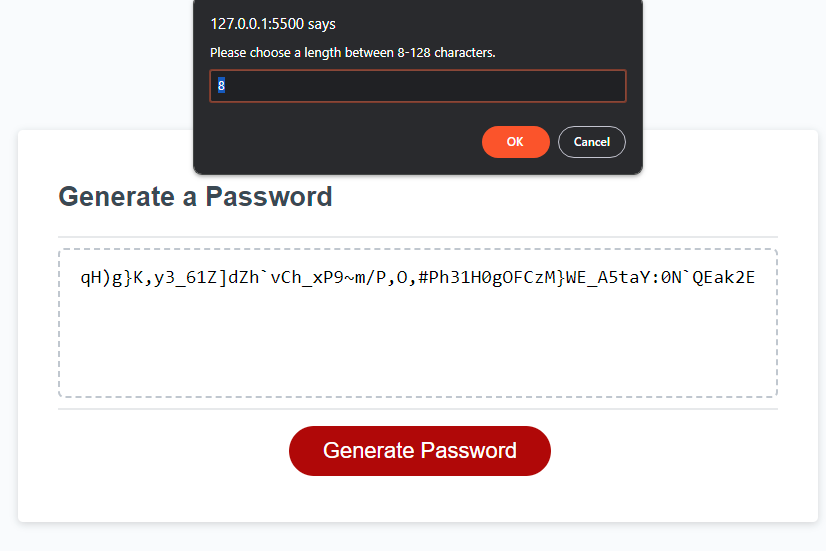

# Password Generator with JS

https://wacwestley30.github.io/PasswordGenerator/

## Description

This is my Password Generator App using Javascript. I built this app to show what I have been learning recently and how far I have come from my last project. This project really taught me a lot more about objects and functions as a whole and how you can store and manipulate data. 

## Usage

When you first load into the site you will be greeted with a blank textbox with "Your Secure Password". When Generate Password button is clicked a series of alerts will ask you questions to better gather the details of what kind of password to generate. Once at least one criteria has been selected a password between 8-128 characters long will be randomly generated inside the textbox to easily use later.

A few things I played with was making sure the alerts gathered all info needed before moving forward.
If a length is not selected it will ask again (default is 8 the minimum). 
If none of the 4 criterias are selected all questions will be asked again.
I really wanted to make sure that all data was gathered first before any generating functions were ran.

